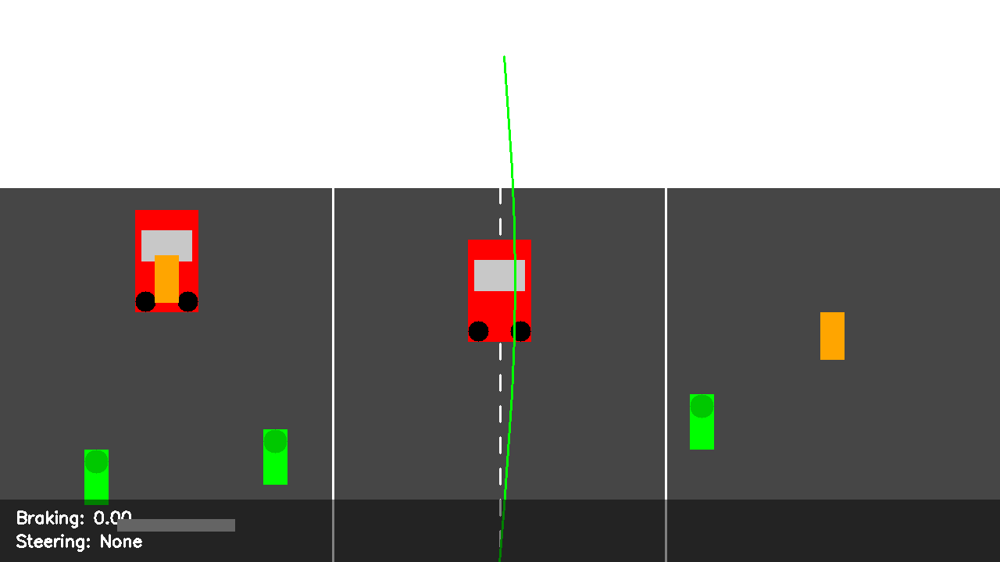

# Advanced Driver Assistance System (ADAS)



This repository contains a modular Advanced Driver Assistance System (ADAS) implementation that integrates multiple sensor inputs to detect obstacles, assess collision risks, and generate appropriate responses for vehicle safety.

## System Architecture

The ADAS system consists of several interconnected modules:

- **Sensor Processing**: Processes raw data from cameras, LIDAR, and radar sensors
- **Sensor Fusion**: Combines data from multiple sensors to create a unified view of the environment
- **Collision Detection**: Identifies potential obstacles and assesses risk levels
- **Collision Avoidance**: Generates appropriate responses based on risk assessment
- **Visualization**: Provides visual feedback of the system's operation

## Features

- Multi-sensor data processing (Camera, LIDAR, Radar)
- Sensor fusion for improved object detection and tracking
- Risk assessment based on distance, time to intersection, and object type
- Adaptive response generation based on risk level
- Visualization of detected objects and risk assessment
- Support for different driving scenarios (urban, highway, night driving)

## Installation

```bash
# Clone the repository
git clone https://github.com/yourusername/ADAS.git
cd ADAS

# Install dependencies
pip install -r requirements.txt
```

## Usage

### Running the Demo

The system includes a demo script that simulates different driving scenarios:

```bash
python demo.py
```

This will run the default demo scenario and display the results.

### Different Driving Scenarios

The system supports multiple driving scenarios:

#### Urban Driving


Urban environments with pedestrians, vehicles, and complex traffic patterns.

#### Highway Driving


Highway scenarios with high-speed vehicles and lane changes.

#### Night Driving


Night-time driving with reduced visibility and different lighting conditions.

## System Components

### Sensor Processing

The system processes data from three types of sensors:

- **Camera**: Detects objects using computer vision techniques
- **LIDAR**: Provides precise distance measurements using point clouds
- **Radar**: Detects objects and their velocities using radar signals

### Sensor Fusion

The fusion module combines data from multiple sensors to create a more accurate representation of the environment. It matches objects across different sensors and merges their properties.

### Collision Detection

The collision detection module identifies potential obstacles in the vehicle's path and assesses their risk level based on:

- Distance to the vehicle's path
- Time to intersection
- Object type (with higher risk for vulnerable road users like pedestrians)

### Collision Avoidance

Based on the risk assessment, the collision avoidance module generates appropriate responses:

- Visual and audible alerts
- Braking recommendations
- Steering adjustments
- Emergency avoidance paths for critical situations

## Extending the System

The modular architecture makes it easy to extend the system:

- Add new sensor types by implementing additional processor classes
- Improve object detection by integrating machine learning models
- Enhance risk assessment with more sophisticated algorithms
- Add new visualization methods for different use cases

## Requirements

- Python 3.6+
- NumPy
- OpenCV
- Matplotlib
- Additional dependencies listed in requirements.txt

## License

This project is licensed under the MIT License - see the LICENSE file for details.